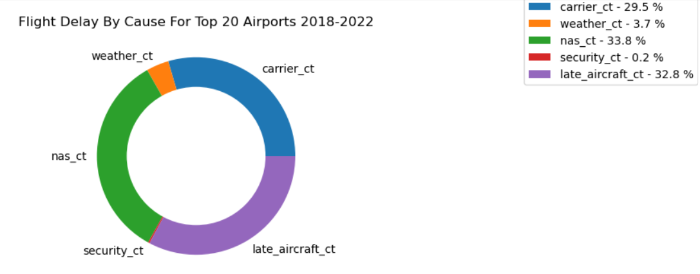
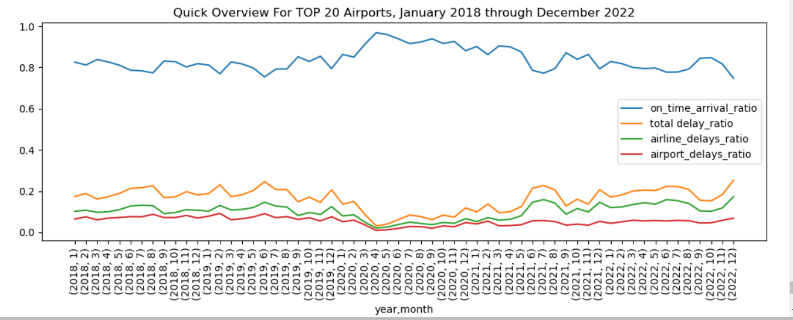
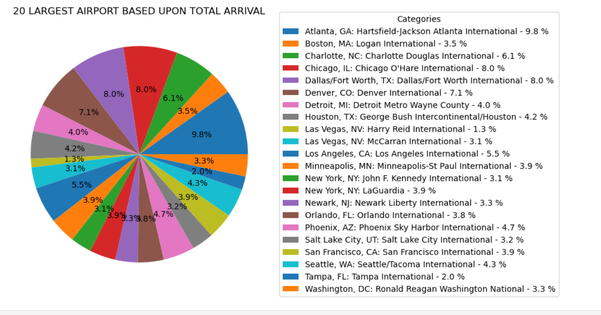
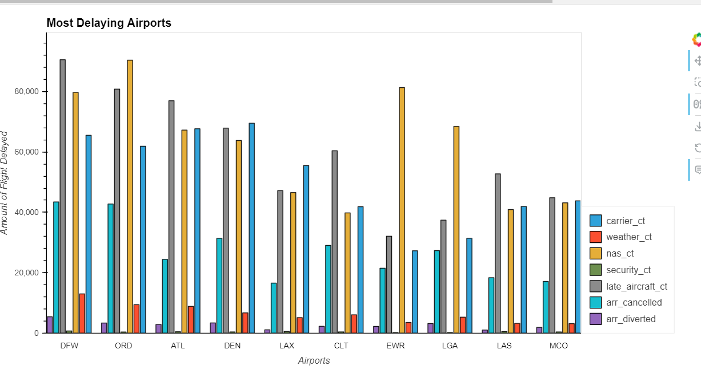
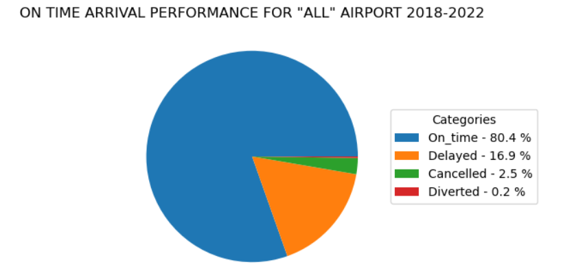
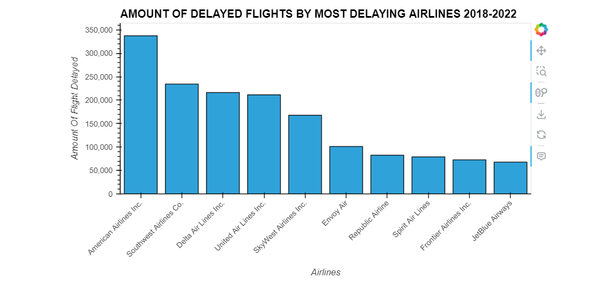

# Analysis Of Flight Delay Data

## Introduction:
Tasked to do a class project using Pandas, a wide spectrum of historical, financial, and comparative analysis was considered. While assessing the requirements of project and scope of our learning, we chose to perform exploratory analysis for flight arrivals and delays for U.S. airports through January 2018 – December 2022. In the first half of 2022, about 20% of the flights were delayed by 15 minutes or more(valuepenguin). A flight is considered delayed when it arrives 15 or more minutes than scheduled.  Delayed minutes are calculated for delayed flights only (Bureau of Transportation Statistics). According to DOT’s Air Travel Consumer Report, leading causes of delay were directly related to airline, such as Air Carier Delay and Aircraft Arriving late, while weather and other situations that were outside of direct control had minimal effect.Senate Joint Economic Committee (SJEC) in their report estimated passengers were delayed by 320 million hours in 2007. 

Travel delayd varies across airports depending upon diffren causes of delay. This project provides an insight into the performance of Top20 U.S. Airports and operating Carriers thereof during 2018-2022. Additionally, it briefly highlights the primary contributors to delays, such as carrier-related issues, weather conditions, NAS inefficiencies, security concerns, or late aircraft arrivals. It could assist travelers to make better decisions in operational and financial aspects of travelling. This project included performance analysis, trend identification and root cause analysis but this data set could be effectively used for predictive modeling.

## Data source and Data Description:
The data source used for this project is a dataset from Kaggle. Dataset is imported through Python library ‘opendatasets’. The dataset consisted of ten years data for US Airlines Arrival from august 2013-August 2023. However, for this project data is filtered out from January 2018 to December 2022 and few unnecessary columns were dropped. Two further columns ‘ %on_time arrival’  and ‘%delay’ have been added. The prepared dataset represent specific flights from that year and includes metrics such as the number of arriving flights, delays over 15 minutes, cancellation and diversion counts, and the breakdown of delays attributed to carriers, weather, NAS (National Airspace System), security, and late aircraft arrivals,  %onetime arrival  and %delay. It is worthy to note that this data set shows the flight statistics by year and month. It does not include time of the day or days of week.

The prepared dataset for 2018-2022 contains no null value. Datatype includes integer, floating and strings. From the prepared dataset two separate data frames are extracted to perform performance and root cause analysis. Since 382 Airports are reported, this project will focus on the Top 20 Airports of United States.  Top 20 Airports are ranked as per Air Travel Consumer Report issued by U.S. Department of Transportation. To describe the location and Geo Mapping of these top airports, longitude and latitude columns are added through separate text file ‘top_20_coordinates.txt’.

To explore data and describe main characteristics of this dataset Pandas describe method is used.  Summary of statistics generated mean, median, lower quartile, upper quartile, minimum and maximum value. The data frame includes 19 carriers.

For purpose of data manipulation, data analysis and data visualization, various libraries, and dependencies from Python are used.
Our analysis include
        
* Top 20 Airport performance;
* Delay by Top airports and airlines;
* Patterns with delayed flights — monthly from 2018-2022;
* Possible causes and their proportionate share

## Analysis:

Through numerical and visual aggregations, our data analysis revealed that arrival performance for Top 20 United States airport during 2018-2022 was about 80%  while 20% of the flights were delayed or cancelled. From the analysis we concluded that nearly one in four airline flights arrived late at their destination by more than 15 minutes. Our analysis also concluded that:

* About 33% of flight delays are caused by the late arrival of the aircraft (the familiar knock-on effect) and propagation delay, where if a craft is delayed, a subsequent flight is also affected.
* About 30% of the delays are by carrier count. Air carrier delay could result from baggage loading, maintenance problems, refueling or even crew punctuality
* About 34% of disruptions are the result of a National Aviation System decision;
* Only 3.7% are caused by bad weather. Extreme weather conditions are the most obvious cause for delay in flights due to weather.
* Air carrier delays could result from baggage loading, maintenance problems, refueling or even crew punctuality.
* Monthly pattren for these 5 years showed that airline causes stayed as leading factors for all airports during the entire period. 
* The total amount of non-weather delays was significantly larger than the total amount of weather delays, making it seem almost dismissable.
* In each month from 2018-2022, flight delays caused by airlines were consistently higher than delays caused by airports.
* The overall trend for root cause delays was a decline from 2018-2020 and then an increase from 2022.
* Security delays were the highest root cause from 2018-2020, which were also the years where security was heavily enforced due to COVID. Starting from * 2020-2022 the highest root cause was carrier delays.
* Carrier, NAS, and late aircrafts delays had the highest positive correlation with flight delays.

 The average delay stayed around 20% during all these period, however it has risen nearly 25 during last month of 2022 i.e. December 2022.
 
 

By collecting further details from different online resources, we explored that airline related causes (which makes more than 60% of total delays) includes maintenance or crew problems, aircraft cleaning, baggage, loading, fueling etc.  Surprisingly the weather’s share of delay is insignificant.That weather category consists of extreme weather that prevents flying. 

Our data analysis further revealed that Atlanta International Airport (ATL) could be termed the hub of air travel. It had the most traffic volume of arriving flights, about 9.8% of all flights. Dallas/Fort Worth International Airport (DFW) & O’Hare International Airport(ORD)  has 8% of the volume share. However when it comes to most delaying airports, Dallas/Fort Worth International Airport (DFW), O’Hare International Airport(ORD), Denver International Airport(DEN), Atlanta International Airport (ATL)  and Los Angeles International Airport(LAX) are the top 5 delaying airports.

 

        
The interactive chart created for each airport provides users flexibility and a set of tool for analysis and to predict the probability of arrival performance and chances of delay for a specific airport and make a quick comparison with the average of all airports. Geo Maps are created to describe the location of Top US Airports reflecting the volume and dealyed ratio thereof.

Coming down to worst arriving airlines, Image 6 shows that American Airlines outpaced all airlines with more than 300,000 delays, Southwest Airlineshad (234,000) and Delta Airlines is at third number with 216,000 flight delays. Combining this information with airline related delays, it can be concluded that airlines's aircraft delays the most common reason for delay is rippling airline's network performance and to airport's national aviation system. The volume of flights in summer has a more significant impact on the chances of delays than the bad weather in winter June, July and August are peak holiday season, so it’s not surprising that delays are more common when the airports are expected to be busier. 

## COVID & Post Pandemic Analysis

Monthly performance Analysis for the pandemic year(2020) and previous year(2022) displays peaks and spikes to indicate periods with a higher likelihood and causes of delays

* Through visual aggregation the amount of arriving and delayed flights for year 2020 (the peak of the Covid pandemic) and 2022 (declining year).
* In 2020, the number of flights drastically declines in march due to increase in cancelled flights. That shows the time period the pandemic was declared.
* The highest arriving number of flights was in December(holiday season) and Jun, Jul, and Aug(summer time) which could be assosiated with increased travelling during December.
* Towards the end of the year 2020, flight cancellation was not much of an issue, but there was an increase in delay. 

References:

2022 has brought more air travel delays and cancellations - valuepenguin. (n.d.). https://www.valuepenguin.com/travel/delays-cancellations-bags-study 

Bureau of Transportation Statistics: https://www.transtats.bts.gov/OT_Delay/OT_DelayCause1.asp
https://chromewebstore.google.com/c

Senate Joint Economic Committee (SJEC), information retrieved from https://centreforaviation.com/analysis/reports/the-cost-of-delays-late-flights-cost-us-economy-usd33-billion-39215
